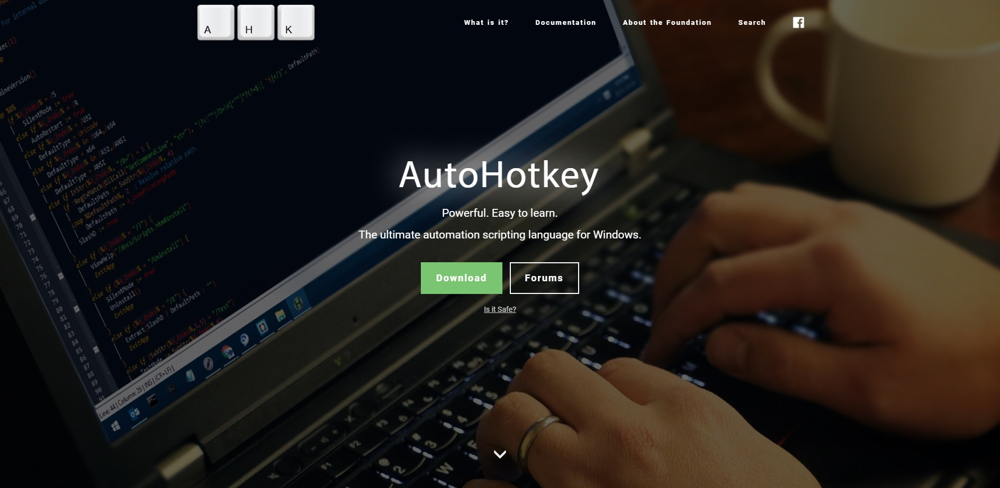
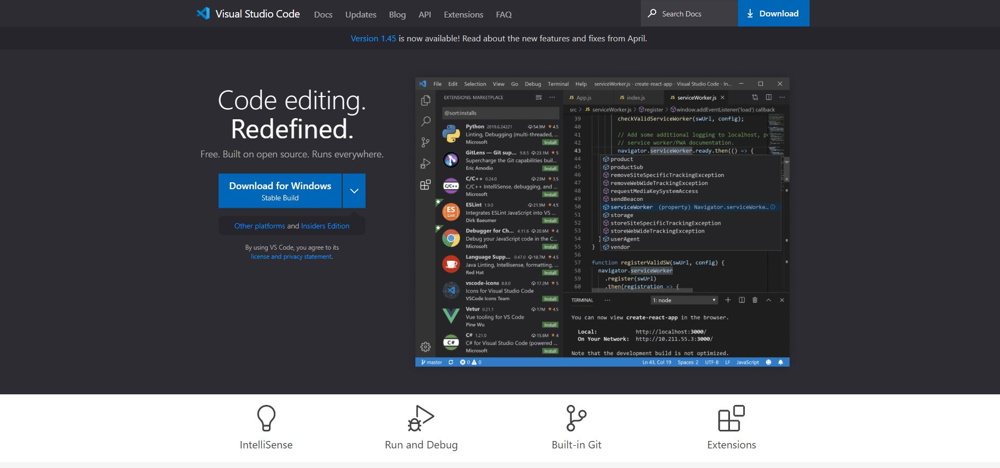
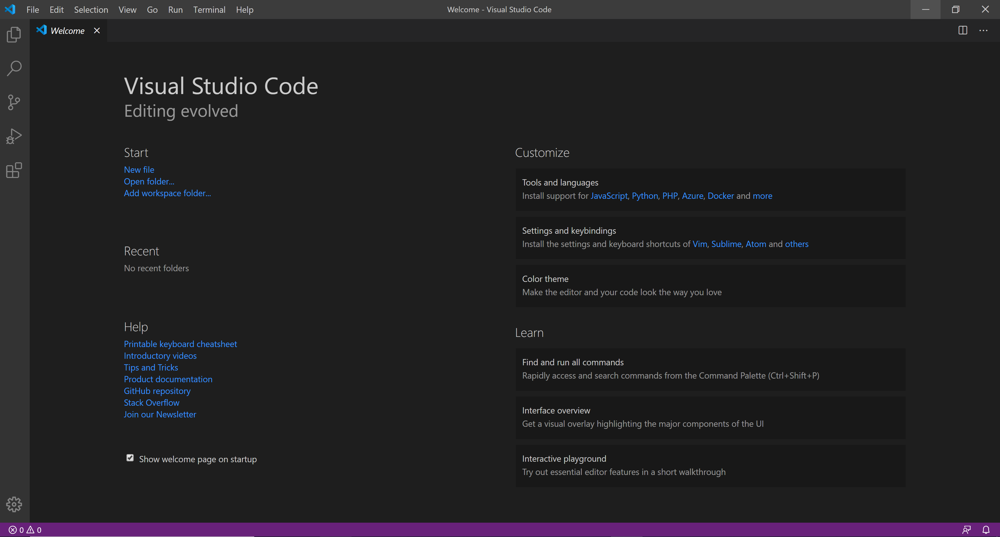
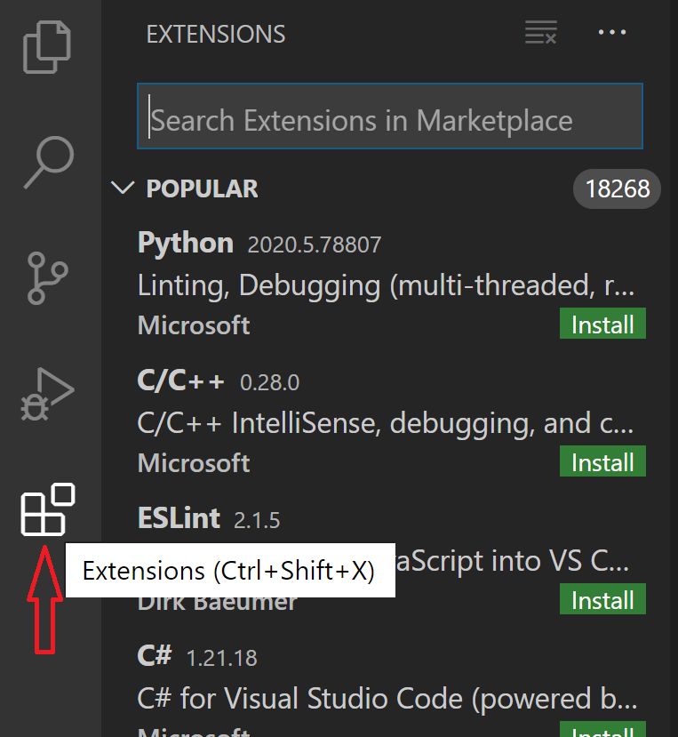
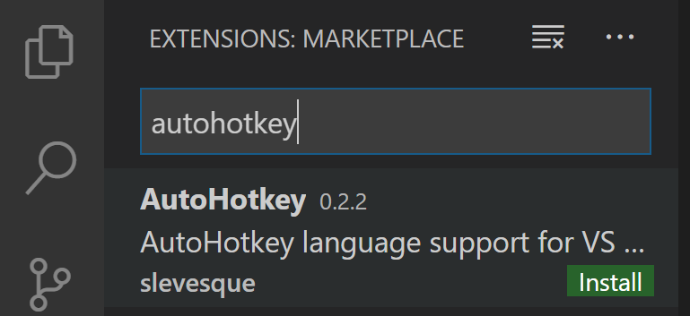
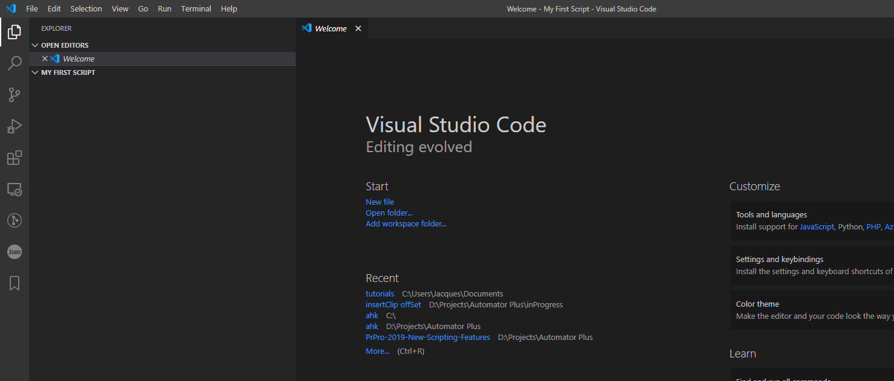
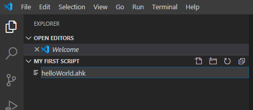
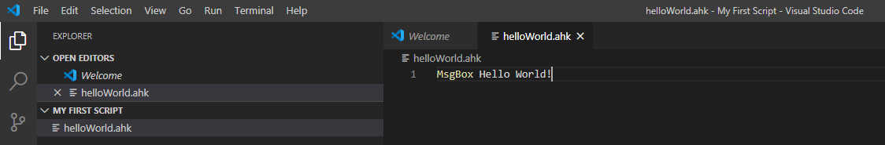
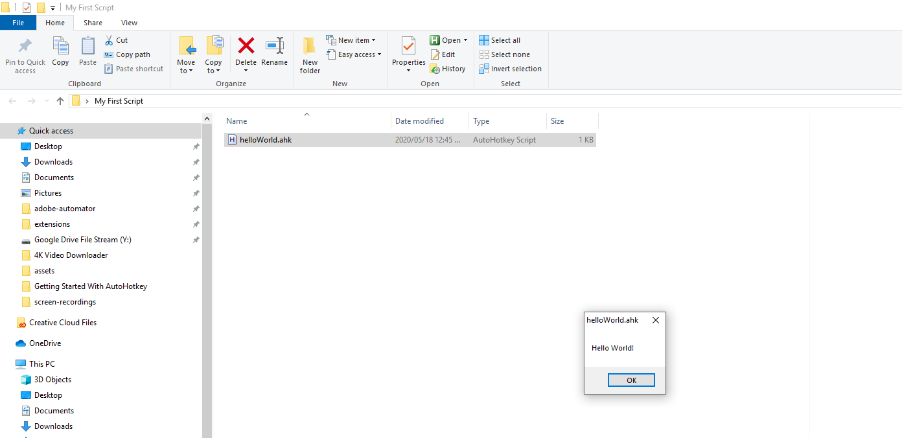

# Start Automating Premiere Pro with AutoHotkey

  
  <cite>Photo by <a href='https://unsplash.com/@peter_s?utm_source=unsplash&utm_medium=referral&utm_content=creditCopyText'>Peter Stumpf</a> on <a href='https://unsplash.com/'>Unsplash</a>.</cite>

- [Start Automating Premiere Pro with AutoHotkey](#start-automating-premiere-pro-with-autohotkey)
  - [Introduction](#introduction)
  - [Exploring AutoHotkey](#exploring-autohotkey)
  - [How to install AutoHotkey.](#how-to-install-autohotkey)
    - [Install AutoHotkey](#install-autohotkey)
    - [Install an IDE](#install-an-ide)
    - [Install the AHK Language in Visual Studio Code.](#install-the-ahk-language-in-visual-studio-code)
  - [Write your first script!](#write-your-first-script)

## Introduction

So you want to automate? Welcome to our channel where we will learn and explore different ways on how to automate and improve our editing workflows.

You've spent a crazy amount of money on that editing system of yours, so why not put it to good use and turn it into an automated beast?

Let's take a look at some examples of the things we'll explore on this channel:

+ One great feature we'll create is a method of automatically exporting JPG images from your favourite footage. All you will need to do is click a single button and let your computer do all the work for you.
+ We'll be looking at creating a script to automatically add warp stabilizer to each of the clips you have selected - one at a time.
+ Another great feature we'll add is a method to automatically set up your workspace as soon as you open Premiere Pro.

The main scripting program that we'll be using is called AutoHotkey and it can be downloaded for free from their [website](https://www.autohotkey.com).

## Exploring AutoHotkey

AutoHotkey is an easy to use, free, open-source scripting language for Microsoft Windows. With it you can create shortcuts to virtually anything and you are able to create powerful macros to automate tedious tasks. Here are a few examples:

+ Mapping your internet browser to a specific shortcut.
+ Using shortcuts to fill in frequently used phrases.
+ Combining various shortcuts together inside your favourite program. For example, inside of Premiere Pro, you can combine the 'select clip at playhead' shortcut with the 'ripple delete shortcut'. 

For the purpose of this channel, we'll be showing you how to use AutoHotkey to automate tedious tasks inside of Premiere Pro.

As the saying goes, there are many ways to skin a cat, and AutoHotkey is but one of the tools available to automate your workflow and it has its own set of pro's and con's. 

The biggest advantage to using AutoHotkey is that it is EASY to use. When we say easy, we mean **really** easy. You don't need any programming knowledge in order to start learning how to use AutoHotkey. Another advantage is that you are able to write scripts for virtually any program, from computer games, to Outlook and straight through to the Adobe Suite.

However, one of the drawbacks to using AutoHotkey is that it is OS specific, meaning you can only use it on a Windows Computer. 

Another drawback is that a lot of the advanced automations that we'll be writing will also be 'computer' specific - meaning that it will be a tedious task to replicate on another computer. 

The biggest drawback of all though, is that you have limited access to information inside of your host program. For example, you can't easily access the timecode, the in and point of clips, the amount of clips on a given timeline, etc, etc.

 ## How to install AutoHotkey.

 ### Install AutoHotkey

Let's navigate to the AutoHotkey [website](https://www.autohotkey.com).

You should see a webpage that looks something like this:

Click on the download button and install AHK onto your computer.

### Install an IDE

The next step is to install an IDE on your computer.

*(An IDE is an acronym for Integrated Development Environment, and an IDE is basically the "text editor" that you code in.)*

You can use any IDE that you want, but I prefer to use Visual Studio Code as it has a lot of useful features. Let's go ahead and navigate to the Visual Studio Code [website](https://https://code.visualstudio.com/). You should see a webpage that looks something like this:

Go ahead and click on the Download for Windows button and install Visual Studio Code onto your computer with the default settings. Once it is installed you can launch Visual Studio Code.

It should look something like this:

### Install the AHK Language in Visual Studio Code.

Now you need to install the AutoHotkey 'language' so that Visual Studio Code knows how to interperet your scripts. Click on the extensions tab on the left hand side of your screen.

In the search bar, type autohotkey and click on the install button that appears.

**That's it!** You are now ready to write your first AutoHotkey script.

## Write your first script!

Let's start with the first script that every first time programmer starts with. The "Hello world!" script.

Go to your desktop and create a new folder called My First Script. Then open up Visual Studio Code and go to file/open folder/ and select the folder you've just created. It should look like this:

The next step would be to create a new AHK file called helloWorld.ahk inside of the open folder. Remember to add the .ahk extension to the end of your file name. 

On the editor side of visual studio code, type `MsgBox Hello World!`

So what does the above mean? Well, let's break it down into pieces:
+ MsgBox - This is an AHK command that creates a 'Message Box' on your computer with the content that you supply it with. 
+ 'Hello World!' is the content that you want the message box to display.

In order to run this script, let's head over to the folder that we created on our desktop. It should now contain an AHK file called "helloWorld". Double click on it and see what happens.

You should now have a little message box appear on your screen that says "Hello World!"

**Congratulations!** You have successfully written your first script! In the next tutorial we'll be looking at ways to to use this in conjunction with Premiere Pro to speed up your editing workflow.

