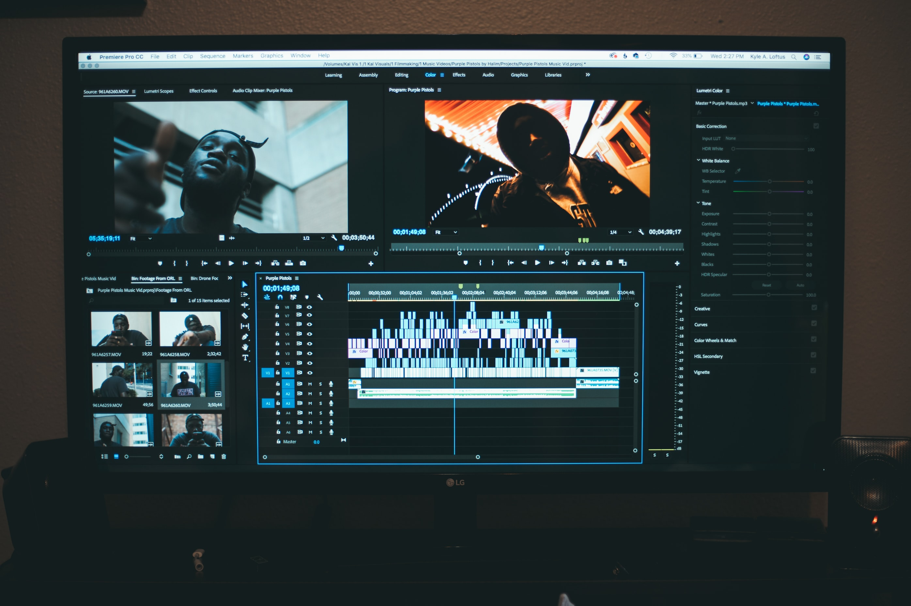

# Navigating the Premiere Pro Timeline with AutoHotkey

  
  <cite>Photo by <a href='https://unsplash.com/@kalvisuals'>Kal Visuals</a> on <a href='https://unsplash.com/s/photos/video-editor?utm_source=unsplash&utm_medium=referral&utm_content=creditCopyText'>Unsplash</a>.</cite>

- [Navigating the Premiere Pro Timeline with AutoHotkey](#navigating-the-premiere-pro-timeline-with-autohotkey)
  - [Introduction](#introduction)

## Introduction

Welcome to the Automator Plus Github repo, where we will show you how to automate your editing workflow. In this video we'll be creating various functions to help navigate the Premiere Pro timeline.

Link to sample code:
https://github.com/automator-plus/tutorials/blob/master/AutoHotkey/navigating-premiere-pro/examples/navigateCommands.ahk
