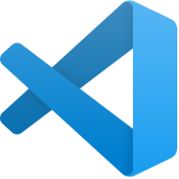
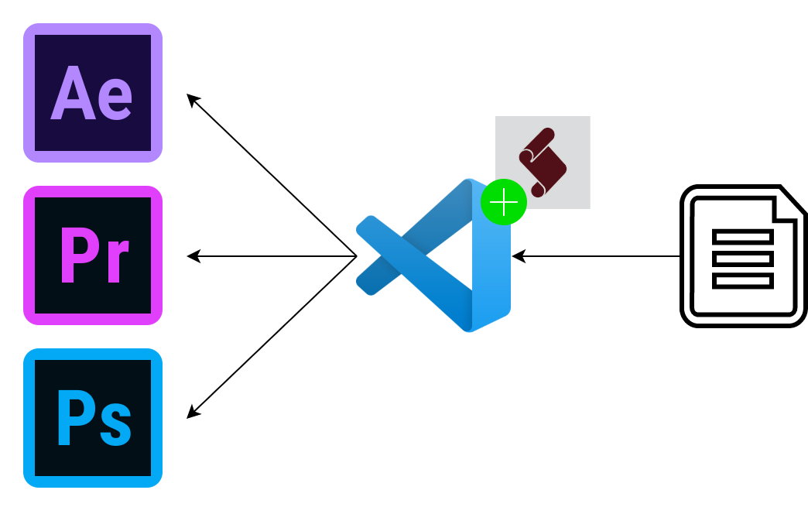

# 1 Getting Started with Adobe ExtendScript

## 1. Introduction

In this tutorial we'll go through the basic steps you'll need to get up and running with executing ExtendScript code from within VS Code against Adobe Premiere Pro as a host. If not all of that made sense, stick around.

 Whether this is your first time having a go at programming something in ExtendScript or if you're already a seasoned ExtendScript programmer, welcome. Irrespective of the extent of your programming knowledge, we hope to show you a few examples of how to take control of your Adobe applications in code and start putting together some supra-natural pipelines and automations. 

In this tutorial we'll cover:

<ul>
    <li>Installing <a href='https://code.visualstudio.com/'>VS Code</a> - the preferred Integrated Development Environment (<a href='https://en.wikipedia.org/wiki/Integrated_development_environment'>IDE</a>) for programming Adobe ExtendScript.</li>
    <li>Installing the official Adobe ExtendScript VS Code Debugger Extension.</li>
    <li>The Basics of the Adobe Premiere Pro CEP API.</li>
    <li>Setting up the VS Code ExtendScript Debugger.</li>
    <li>Running some basic CEP API code from within VS Code.</li>
</ul>

 If you've never coded in you're life, don't worry! And if acronyms like IDE, CEP and API are still a bit foreigner to you, great! Then you might actually learn something... If you already know these acronyms, we still hope we can teach you something. Ultimately, we want to bring you the knowledge that will show you how to unlock the superpowers that programming the Adobe suite unlocks.

 ## 2. What is an IDE

To start, an IDE is an acronym for Integrated Development Environment, and an IDE is basically the "text editor" that you code in. I say "text editor" in air quotes as your "text editor" when coding isn't <i>just</i> a "text editor", it is your interface into the matrix and choosing the right IDE ensures a high bandwidth connection. There is an old saying about a bad workman always blaming his tools, and there is truth in that. However, not when it comes to IDE's. Some IDE's give you supra powers, others give you just powers. 

Luckily, Adobe has made the best choice for us all by releasing an open-source VS Code Debug Extension that enables the VS Code Application to connect into the Adobe CC applications. Previously, you had to use the Adobe created ExtendScript Toolkit to run your Adobe ExtendScript code, read more <a href='https://www.adobe.com/devnet/scripting.html'>here</a>. Let's just say that the user experience of the ExtendScript Toolkit isn't something you'll write home about and learning how to program while using such a difficult UI has made it difficult in the past for non-programming folk to get started with the CEP API. Luckily, the the VS Code extension that Adobe open sourced changes all that. 

For the non-programming folk, open-source software is essentially free software, well sort off. The code is freely available for you to use and abuse. To get an idea of what open-source software entails, you can think of projects like JavaScript, <a href='https://www.python.org/'>Python</a> or <a href='https://www.linux.org/'>Linux</a>. You don't need to buy a license from the creators to build products using any of these project. 

You might think why would Adobe make software available for free and not charge for it. Well, they've learned from the rest of the world that the only way to have a stable code base is to make your code open-source that the open-source community, you and I, can build, test and deploy useful add-ons to their software without any cost to them. So open source isn't completely free, Adobe still employs many software engineers to write and maintain the CEP API, however, the benefit that Adobe gets by having the entire world test their code base and create new plug-ins outweighs the costs tenfold. 

## 3. The Adobe CEP API

Let's look at the various components that you'll need when developing automation or actions using ExtendScript, VS Code and Premiere Pro. 

<table style="width:100%">
    <tr>
        <th style="text-align:left">Component</th>
        <th style="text-align:left">Description</th>
    </tr>
    <tr>
        <td style="text-align:right"></td>
        <td><b>The host - any Adobe application</b> 
          
        Get used to calling your Adobe applications like Premiere Pro, Photoshop or After Effect the <i>host</i> application. This is to make a distinction between the client (the code we'll be writing) and the Adobe application we're interacting with - the host. </td>
    </tr>
    <tr>
        <td style="text-align:right"></td>
        <td><b>VS Code - the IDE</b>
          
        This is the application we'll use to write and debug our ExtendScript code. There are various IDEs out there, like: <a href='https://atom.io/'>Atom</a>, <a href='https://www.sublimetext.com/'>Sublime Text</a> or <a href='https://notepad-plus-plus.org/downloads/'>Notepad++</a>. However, none of them quite compare to VS Code. 
          
        Besides the fact that VS Code is the only IDE, besides ExtendScript Toolkit, that has an extension to plug into your Adobe applications to debug your code, the UX of VS Code and all the other extension you can install will quickly make VS Code your default editor for everything. Hell, I'm typing this in VS Code at the moment...</td>
    </tr>
    <tr>
        <td style="text-align:right"></td>
        <td><b>ExtendScript - the programming language</b> 
          
        To be honest, Adobe could've chosen a better name for their programming language. "ExtendScript" is an attempt to convey the idea of - wait for it - "Extend"-ing JavaScript.
         
         
        The reason why I think "ExtendScript" is not the best choice of programming language name for Adobe suite of tools is due to the file extension,  <code>.jsx </code>. You might be thinking, what's wrong with jsx? JavaScript files are <code>.js</code>, extending them leads to <code>.jsx</code>. And I agree with you're logic... 👌 
          
        However! If you google  <code>.jsx </code> you'll find a can of worms not entirely unrelated to making plug-ins for Adobe hosts, but enough so to confuse you. Beware,  <code>.jsx </code> is a very common file extension and don't expect all  <code>.jsx</code> files to be Adobe ExtendScript files, on the contrary, expect they're not! 
          
        To give you a taste of the type of code you'll be writing, below I show some code written in the <b>Adobe ExtendScript</b>  language that uses the <b>CEP API</b> to set the targeted state the first video clip in Premiere Pro to true. 
        <pre>videoTracks = app.project.activeSequence.videoTracks; // Get all the video tracks
firstTrack = videoTracks[0]; // Get the first video track
firstTrack.setTargeted(true, true); // Set the track's targeted attributed</pre>
        The code above follows 3 steps to change the targeted attribute of the first track to true. 
        <ul>
        <li>First we get all the video track objects of the active sequence and store them in a list called <code>videoTracks</code>.</li>
        <li>
        We can then select the first video track by using the <code>videoTracks[0]</code> syntax and store the first track object in a variable called <code>firstTrack</code>. Unfortunately, video track <code>1</code> in Premiere Pro is at position <code>0</code> in the <code>videoTracks</code> list. Not a train smash, but we'll have to remember that in future. 
        </li>
        <li>Now that we've got a grip on the first track in Premiere Pro via the <code>firstTrack</code> variable, we can execute the <code>setTargeted</code> method. 
        </li>
        </ul>
        For the interest sake, we could've done the same thing in one step:
        <pre>
app.project.activeSequence.videoTracks[0].setTargeted(true, true)</pre>
However, code readability goes a long way and is usually preferred over cryptic concise code that makes little sense. How descriptive or concise you want to write your code is up to you - you'll develop your own style with time. If you're starting out, write out as much as you can, making temporary variables along the way to make your code more readable and more understandable - comments also help. 
         </td>
    </tr>
    <tr>
        <td style="text-align:right"></td>
        <td><b><a href='https://marketplace.visualstudio.com/items?itemName=Adobe.extendscript-debug'>VS Code ExtendScript Debugger</a> - the extension</b>
          In my personal opinion, the VS Code ExtendScript Debugger is what is making programming in ExtendScript within the Adobe applications more accessible to non-programmers in recent years. 
          
        In essence, the extension translates our written JavaScript or "ExtendScript" code to commands that the Adobe host applications can understand. In other words, the extension allows us to use VS Code to debug and run our code against an Adobe application. The previous industry standard was Adobe's ExtendScript Toolkit, which as I mentioned, wasn't known for its accessibility.</td>
    </tr>

</table>

In summary, we'll hook-up our VS Code text editor with the Adobe applications through the ExtendScript Debugger extension which will allow us to execute and debug ExtendScript code from within VS Code. How all these components fit together looks something like this: 

## 4. Setting Everything Up

### 4.1. VS Code

First, we'll head over to the VS Code website  <a href='https://code.visualstudio.com/'>here</a> and do the download deed for your operating system. 

Go ahead and click the next-next-next on Windows or drag VS Code into Applications on Mac.

### 4.2. Debug Extension

Next, we're going to install the ExtendScript Debugger extension by going to the extensions tab within VS Code. You can find the extension tab by clicking on the 4 square icon, 👇 this one.

Once on the extension tab, you can search for the term "ExtendScript". You should now see something simliar to:

Go ahead and install both the <b>ExtendScript Debugger</b> extension as well as the extension just titled <b>ExtendScript</b>. The later extension will allow for syntax highlighting for the ExtendScript language within VS Code. In other words, VS Code becomes aware of what are valid ExtendScript commands and colours your files accordingly. To be sure the extensions are successfully installed, go ahead and close and reopen VS Code.

## 5. Running some code

In this section we'll execute a basic ExtendScript 

### 5.1 Creating an ExtendScript File

### 5.2. The launch.json file

Once you've installed the extension 