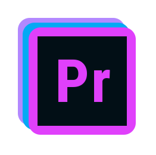
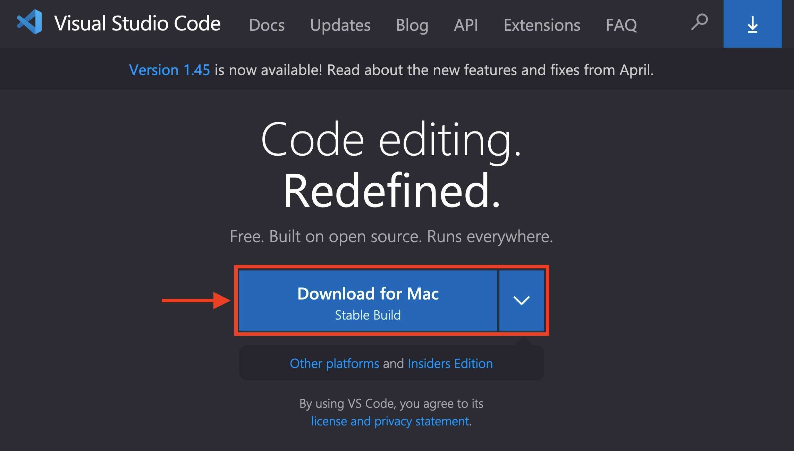
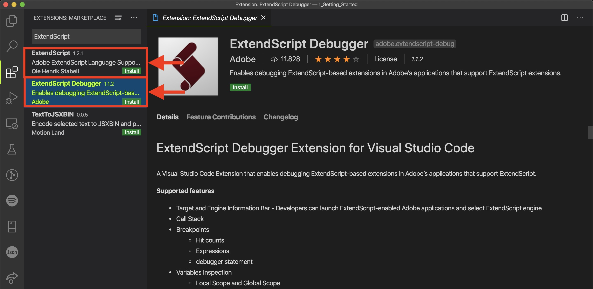

# Introduction to Adobe Scripting with CEP and VS Code

## 1. Introduction

In this tutorial we'll go through installing <a href='https://code.visualstudio.com/'>VS Code</a>, the preferred Integrated Development Environment or <a href='https://en.wikipedia.org/wiki/Integrated_development_environment'>IDE</a> for programming Adobe ExtendScript. If you don't have any programming experience, concepts like an IDE and Adobe ExtendScript might be a bit foreigner, but fret not, that's why we're here, to build it up from the ground and enable you as a creative to gain the superpowers that programming the Adobe suit unlocks.

To start, an IDE is an acronym for Integrated Development Environment, an is basically the "text editor" that you code in. I say "text editor" in air quotes as your "text editor" when coding isn't <i>just</i> a "text editor", it is your interface into your code base and choosing a good IDE will help you on your way to greatness much quicker. There is an old saying about a bad workman always blames his tools, and there is truth in that. However, when it comes to IDE's some give you supra powers, other give you powers. 

Luckily, Adobe has made the best choice for us by creating and open sourcing a VS Code Extension to enable VS Code to connect directly into the Adobe applications. Previously, you had to use the Adobe created Extend Script Toolkit, read more <a href='https://www.adobe.com/devnet/scripting.html'>here</a>, to run your Adobe ExtendScript code - let's just say that the user experience of the Extend Script Toolkit isn't something you'll write home about. Personally we feel this has made it difficult in the past for non-programming folk to get started with the CEP API which has been around for years, luckily VS Code changes all that. 

For the non-programming folk, open source software is essentially free software, well sort off. The code is freely available for you to use and abuse and you might think why would Adobe make software available for free. Well, they've learned from the rest of the world that the only way to have a stable code base is to make your code open source that the open source community, you and I, can build, test and deploy useful add-ons to their software without any cost to them. So open source isn't completely free, Adobe still employs many software engineers to write the CEP API, however, the benefit that Adobe gets by having the entire world test and request features to their code base outweighs the costs ten fold. 

## 2. The Adobe CEP API

Let's look at the various components that you'll need when developing automations or actions using ExtendScript, VS Code and Premiere Pro. 

<table style="width:100%">
    <tr>
        <th style="text-align:left">Component</th>
        <th style="text-align:left">Description</th>
    </tr>
    <tr>
        <td style="text-align:right"></td>
        <td><b>The host - any Adobe application</b> 
          
        Get used to calling your Adobe applications like Premiere Pro, Photoshop or After Effect the <i>host</i> application. This is to make a distinction between the client (the code we'll be writing) and the Adobe application we're interacting with - the host. </td>
    </tr>
    <tr>
        <td style="text-align:right"></td>
        <td><b>VS Code - the IDE</b>
          
        This is the application we'll use to write and debug our ExtendScript code. There are various IDEs out there, like: <a href='https://atom.io/'>Atom</a>, <a href='https://www.sublimetext.com/'>Sublime Text</a> or <a href='https://notepad-plus-plus.org/downloads/'>Notepad++</a>. However, none of them quite compare to VS Code. 
          
        Besides the fact that VS Code is the only IDE, besides ExtendScript Toolkit, that has an extension to plug into your Adobe applications to debug your code, the UX of VS Code and all the other extension you can install will quickly make VS Code your default editor for everything. Hell, I'm typing this in VS Code at the moment...</td>
    </tr>
    <tr>
        <td style="text-align:right"></td>
        <td><b>ExtendScript - the programming language</b> 
          
        To be honest, Adobe could've chosen a better name for their programming language. "ExtendScript" is an attempt to convey the idea of - wait for it - "Extend"-ing JavaScript.
         
         
        The reason why I think "ExtendScript" is not the best choice of programming language name for Adobe suite of tools is due to the file extension,  <code>.jsx </code>. You might be thinking, what's wrong with jsx? JavaScript files are <code>.js</code>, extending them leads to <code>.jsx</code>. And I agree with you're logic... 👌 
          
        However! If you google  <code>.jsx </code> you'll find a can of worms not entirely unrelated to making plug-ins for Adobe hosts, but enough so to confuse you. Beware,  <code>.jsx </code> is a very common file extension and don't expect all  <code>.jsx</code> files to be Adobe ExtendScript files, on the contrary, expect they're not! 
          
        To give you a taste of the type of code we'll be writing, below I show some Adobe ExtendScript code that will allow us to add a specified number of Audio tracks. We'll go more into the code at a later stage, but just as a starter dish you can get an idea of where we are going.
          
        
<pre style="margin: 0; line-height: 125%">createAudioTracks = function (nrTracks) { 
    app.enableQE();
    var sqe = qe.project.getActiveSequence();
    for (var i = 0; i &lt; nrTracks; i++){
            sqe.addTracks(1);
            sqe.removeVideoTrack(0)
        }
}
var nrTracks = 4
createAudioTracks(nrTracks)
</pre>

         </td>
    </tr>
    <tr>
        <td style="text-align:right"></td>
        <td><b><a href='https://marketplace.visualstudio.com/items?itemName=Adobe.extendscript-debug'>VS Code ExtendScript Debugger</a> - the extension</b>
          In my personal opinion, the VS Code ExtendScript Debugger is what is making programming in ExtendScript within the Adobe applications more accessible to non-programmers in recent years. 
          
        In essence, the extension translates our written JavaScript or "ExtendScript" code to commands that the Adobe host applications can understand. In other words, the extension allows us to use VS Code to debug and run our code against an Adobe application. The previous industry standard was Adobe's ExtendScript Toolkit, which as I mentioned, wasn't known for its accessibility.</td>
    </tr>

</table>

In summary, we'll hook-up our VS Code text editor with the Adobe applications through the ExtendScript Debugger extension which will allow us to execute and debug ExtendScript code from within VS Code. How all these components fit together looks something like this: 

## 3. Installing Everything

### VS Code

First we'll head over to the VS Code website  <a href='https://code.visualstudio.com/'>here</a> and do the download deed for your operating system. 

Go ahead and click the next-next-next on Windows or drag VS Code into Applications on Mac.

### Debug Extension

Next we're going to install the ExtendScript Debugger extension by going to the extensions tab within VS Code. You can find the extension tab by clicking on the 4 square icon:

Once on the extension tab, you can search for the term "ExtendScript". You should now see something simliar to:

Go ahead and install both the ExtendScript Debugger extension as well as the extension just titled "ExtendScript". The later will allow for syntax highlighting for the ExtendScript language within Visual Studio Code. 

## 4. Running Some Code