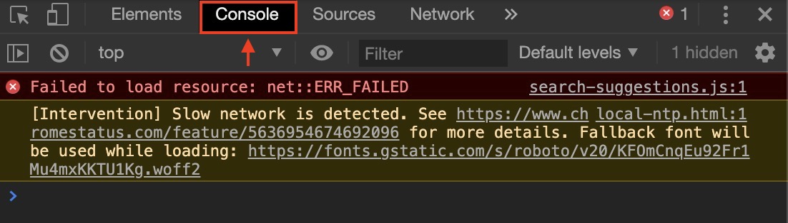
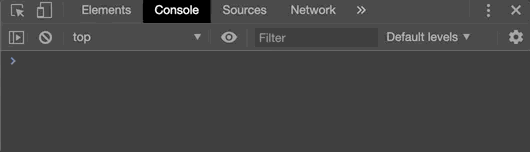
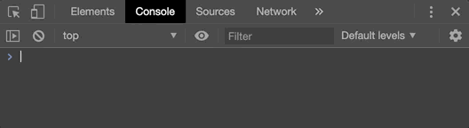
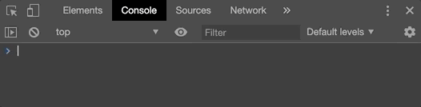

# Tutorial 2: Adobe's ExtendScript Programming Basics
<p align="center">
  
  <cite>Photo by <a href='https://unsplash.com/@ffstop?utm_source=unsplash&utm_medium=referral&utm_content=creditCopyText'>Fotis Fotopoulos</a> on <a href='https://unsplash.com/'>Unsplash</a>.</cite>
</p>

## History of JS and Adobe's Extend Script

Below is a shameless copy from Wikipedia. Why rewrite what has been curated over the years by the world: 

JavaScript often abbreviated as <b>JS</b>, is a <a href="https://en.wikipedia.org/wiki/Programming_language" title="Programming language">programming language</a> that conforms to the <a href="https://en.wikipedia.org/wiki/ECMAScript" title="ECMAScript">ECMAScript</a> specification. JavaScript is <a href="https://en.wikipedia.org/wiki/High-level_programming_language" title="High-level programming language">high-level</a>, often <a href="https://en.wikipedia.org/wiki/Just-in-time_compilation" title="Just-in-time compilation">just-in-time compiled</a>,
and <a href="https://en.wikipedia.org/wiki/Programming_paradigm" title="Programming paradigm">multi-paradigm</a>. 
Alongside HTML and CSS, JavaScript is one of the core technologies of the World Wide Web. JavaScript enables interactive web pages and is an essential part of web applications. The vast majority of websites use it for client-side page behaviour, and all major web browsers have a dedicated JavaScript engine to execute it.

JavaScript is a language we love to hate. As it has become such a bastardised language over the years, you can really do anything with JavaScript, there are plug-ins for almost everything and there's a ton of online resources available to help you learn. But, who's in control of the JavaScript language? Who says *this* is how we do things in the JavaScript language? And more importantly, how does it relate to Adobe's ExtendScript? 

Via the <a href="https://en.wikipedia.org/wiki/ECMAScript" title="ECMAScript">ECMAScript</a> specification. 

> ECMAScript first appeared in 1997 as a <a href="/https://en.wikipedia.org/wiki/Scripting-language" class="mw-redirect" title="Scripting-language">scripting-language</a> <a href="/https://en.wikipedia.org/wiki/Specification_(technical_standard)" title="Specification (technical standard)">specification</a> standardized by <a href="/https://en.wikipedia.org/wiki/Ecma_International" title="Ecma International">Ecma International</a>. JavaScript has remained the most widely used implementation of ECMAScript since the standard was first published, with other implementations including <a href="/https://en.wikipedia.org/wiki/JScript" title="JScript">JScript</a> and <a href="/https://en.wikipedia.org/wiki/ActionScript" title="ActionScript">ActionScript</a>.

Funny how the Wikipedia community doesn't even mention <a href='https://en.wikipedia.org/wiki/ExtendScript'>Adobe's ExtendScript</a> as another, quite successful, implementations of ECMAScript. But it is, Adobe's ExtendScript was build using the ECMAScript 3 standard published in December 1997. Pretty old, right? To give you an idea, in 2019 the ECMAScript 10 standard was published. For a full list of the ECMAScript version you can check <a href='https://en.wikipedia.org/wiki/ECMAScript#Versions'>this</a> out. 

What does this all mean to you and me as Adobe ExtendScript developers? Well, think about it this way. If you were Adobe in the early 2000 and you needed a programming language to interact with your awesome suite of applications, would you write a programming language yourself? Or, start using a variant of a language that already has traction; and more importantly, a language that already has developers that speak it. 

For us, in 2020 this means we are going to be writing JavaScript code, but old-school JavaScript code - not that the core functionality and syntax of JS changed much from 1997 to 2020. Notice I say *core* functionality. Don't get me wrong, many benefits come with using the latest ECMAScript standards, such as many more built-in function that ease your life and more concise syntax that encourages writing much cleaner and more robust code. So ideally we want to write our code in ES6 JavaScript, JS as it used mostly on the today, but when we deploy our code we want to deploy ES3 code so that Adobe understands it. Luckily technologies exist that do exactly that for us, translate our code between different versions of ECMAScript. 

However, all of this ECMA stuff only becomes important when you're getting serious about writing ExtendScript and you want to distribute a sustainable extension. However, for us today, we're doing *basic* ExtendScript programming, but keep the ECMAScript version concept in mind when you copy JS code from the web and it doesn't just work in your ExstendScript code - it might have a syntax that is not supported in ECMAScript 3. 

## Writing JavaScript in Chrome

Since the core JS syntax like declaring a variable, adding numbers together or printing something out to the console hasn't changed much over time, we can hop into our Chrome debugger, which will give us an easy place to write some JS code and explain the above concepts. To open a console in Chrome, right-click anywhere on an open webpage and click `Inspect`. I show this below, but you're going to have to excuse my Dutch. Clicking on `Inspect` should bring up the the `Chrome Inspector` and you're going to want to go to the `Console` tab shown below. Depending on which web page you opened your inspector in, your warning and error messages might differ. 


<p align="center">
  
</p>


Great! Maybe you didn't know that all browsers have a JavaSript console built-in. BTW they do, sometimes it is just a bit tricky to get to them. I know with Safari on Mac you've got to enable "Developer Tools". The interface you are presented with, the image shown above, is what we call a <a href='https://en.wikipedia.org/wiki/Command-line_interface'>Command Line Interface</a> (CLI) as opposed to a <a href='https://en.wikipedia.org/wiki/Graphical_user_interface'>Graphical User Interface</a> (GUI). The difference? The one uses pictures, the other uses text. for reference, the `console` is also sometimes referred to as the `terminal` or just `CLI`. 


### Hallo World

There is a coding tradition that the first program you write in any new language has something to do printing out or displaying the text "hallo world". At the bottom of your console, next ot the `>`-character is where we're going to be writing some code.

<p align="center">
  
</p>

Execute the following command in the console:

```javascript
console.log("Hallo World");
```

<p align="center">
  
</p>

Let's unpack what is happening here. We've used the built in JS function `console.log` to print out "Hallo World" to the console. Pretty intuitive right? Let's go a step further. 


### Variables

Variables... What are variables? 

Essentially variables are placeholders, things that house values for us that change (are variable) over time. For example, below we will declare 2 variables called `a` and `b`. These names are completely arbitrary and it is up to you to choose meaningful variable names - `a` and `b` are bad variable names BTW.

In JavaScript we declare variables using the `var` keyword, like `var a = 1`. OK, you don't have to type `var`, `a = 1` will work just fine. However, this is where those ECMA Script version snags come in. In ES3 it is fine to declare your variables without using `var`, however if you're going to be transpiling code from ES6 to ES3, you're going to need the `var` keyword. 

Small things like this give the later versions of ECMAScript its robustness. In the background JavaScript can do a lot more checks and balances if you _explicitoly_ declare what type of variable you are declaring. A variable that will change over time, or a variable that will stay constent. In the later versions of ECMAScript there's a distinction, for example:

```javascript
var a = 3;
const b = 4;
```

If you later want to reassign `b` an error will be thrown,

<p align="center">
  
</p>

Compared to assigning a value to `a`,

<p align="center">
  
</p>

However, if you type nothing, 

```javascript
a = 3;
b = 4;
```

anything can really be done with your variable downstream. So where does this leave you? Rather use `var` instead of nothing. This way you can use you're code later on if you start using transpilers, also, it's only 4 characters and a good JS coding habit to form. Until you know why the other keywords exists and know why you need them, just use `var`. 

Ok, so variable hold values. But why? Well, to make programming more modular and easier to write. To bring it back to the Premiere Pro API, instead of writing:

```javascript
app.project.activeSequence.videoTracks[0].setMute(true);
```

We can be a bit more verbose, declaring intermediary variables to store our sub computations and make the code more readable, maintainable and ultimately suistainable. 

```javascript
videoTracks = app.project.activeSequence.videoTracks; // Get all the video tracks
firstTrack = videoTracks[0]; // Get the first video track
firstTrack.setMute(true); // Set the firstTrack's muted attribute using the setMute method
```

But what about efficiency I hear you say? Doesn't declaring more variable take up more space in memory? In the background JS doens't really need *that* much more space to store your extra variable because of what are called pointers. With most *big* things we want to store in variables, we only store them in one place and then *point* to them. Pointers are way outside of the scope this series, but just some motivation as to why more variables are usualy a good things if you're code is more readiable and understandable. 

Someone once said: "machines don't read code, humans do."

### Variable Types

After the value of your variable stored in RAM, your variable's type is the seconds most important thing to take note of. Knowing which type your variable is will allow you to anticipate how they will behave when certain opertaions are applied to them. For example, if we declare 2 text variables, called  *string* variables,

```javascript
var greetingTemplate = "Hallo there, ";
var name = "John";
var result = greetingTemplate + name;
console.log(result);
```

and I sum them together using the `+` operator I get, "Hello there, John"

<p align="center">
  
</p>

You can think that the behaviour will be different if I declare 2 numbers, for example

```javascript
var number1 = 1;
var number2 = 2;
var result = number1+number2;
console.log(result);
```


<p align="center">
  
</p>

So what tells JavaScript which is which? The double quoates, `""`, in this case. If we write anything in double quotes JavaScript interprets it as a string. We can check the types of variables using the `typeof` function, for example

```javascript
var stringNumber = "2";
var numberNumber = 2;
console.log(typeof(stringNumber))
console.log(typeof(numberNumber))
```


<p align="center">
  
</p>

