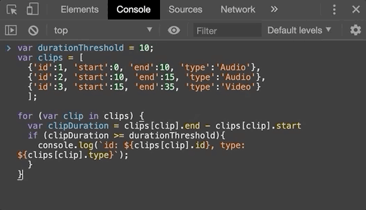
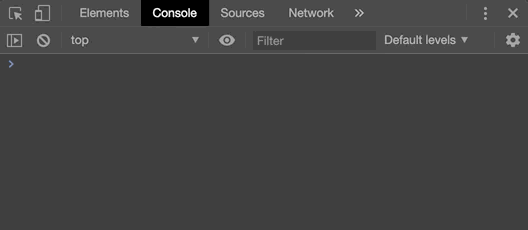
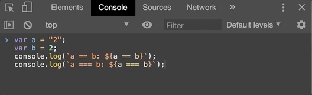

<h1> Adobe's ExtendScript Programming Basics</h1>


<p align="center">
  
  <cite>Photo by <a href='https://unsplash.com/@ffstop?utm_source=unsplash&utm_medium=referral&utm_content=creditCopyText'>Fotis Fotopoulos</a> on <a href='https://unsplash.com/'>Unsplash</a>.</cite>
</p>

<h2> Table of Content</h2>

- [History of JS and Adobe's Extend Script](#history-of-js-and-adobes-extend-script)
- [Writing JavaScript in Chrome](#writing-javascript-in-chrome)
- [JS Basics](#js-basics)
  - [Hallo World](#hallo-world)
  - [Variables](#variables)
  - [Variable Types](#variable-types)
  - [If Statements](#if-statements)
  - [For Loops](#for-loops)
  - [Objects](#objects)
  - [Bringing it together](#bringing-it-together)
- [Something with PP API?](#something-with-pp-api)
- [Conclusion](#conclusion)

# History of JS and Adobe's Extend Script

Below is a shameless copy from Wikipedia. Why rewrite what has been curated over the years by the world? 

JavaScript often abbreviated as <b>JS</b>, is a <a href="https://en.wikipedia.org/wiki/Programming_language" title="Programming language">programming language</a> that conforms to the <a href="https://en.wikipedia.org/wiki/ECMAScript" title="ECMAScript">ECMAScript</a> specification. JavaScript is <a href="https://en.wikipedia.org/wiki/High-level_programming_language" title="High-level programming language">high-level</a>, often <a href="https://en.wikipedia.org/wiki/Just-in-time_compilation" title="Just-in-time compilation">just-in-time compiled</a>,
and <a href="https://en.wikipedia.org/wiki/Programming_paradigm" title="Programming paradigm">multi-paradigm</a>. 
Alongside HTML and CSS, JavaScript is one of the core technologies of the World Wide Web. JavaScript enables interactive web pages and is an essential part of web applications. The vast majority of websites use it for client-side page behaviour, and all major web browsers have a dedicated JavaScript engine to execute it.

JavaScript is a language programmers love to hate. Over the years, JavaScript has become such a bastardised language; you can really do anything with JavaScript. Usually, there's a plug-in for almost everything you want to do and there are a ton of online resources available to help you on your way to greatness. For a concise JS tutorial you can check out <a href='https://www.learn-js.org/'>learn-js'</a> tutorial, or if you're looking for a tutorial with a bit more around the waist, check out <a href='https://www.w3schools.com/js/'>w3schools'</a> tutorial. 

But, who's in control of the JavaScript language? Who says *this* is how we are doing things in *this* version of the JavaScript language? Who decides what stays and what goes over the years? All these are good questions, however, probably the most important question about JavaScript for us in this tutorial is:

>How does JavaScript relate to Adobe's ExtendScript?

And the answer is... 

JavaScript is related to Adobe's ExtendScript via the <a href="https://en.wikipedia.org/wiki/ECMAScript" title="ECMAScript">ECMAScript</a> specification. Again, from the wiki:

> ECMAScript first appeared in 1997 as a <a href="/https://en.wikipedia.org/wiki/Scripting-language" class="mw-redirect" title="Scripting-language">scripting-language</a> <a href="/https://en.wikipedia.org/wiki/Specification_(technical_standard)" title="Specification (technical standard)">specification</a> standardized by <a href="/https://en.wikipedia.org/wiki/Ecma_International" title="Ecma International">Ecma International</a>. JavaScript has remained the most widely used implementation of ECMAScript since the standard was first published, with other implementations including <a href="/https://en.wikipedia.org/wiki/JScript" title="JScript">JScript</a> and <a href="/https://en.wikipedia.org/wiki/ActionScript" title="ActionScript">ActionScript</a>.

Funny how the Wikipedia community doesn't even mention <a href='https://en.wikipedia.org/wiki/ExtendScript'>Adobe's ExtendScript</a> as another, quite successful, implementations of ECMAScript. But it is, Adobe's ExtendScript was build using the ECMAScript 3 standard published in December 1997. Pretty old right? To give you an idea, in 2019 the ECMAScript 10 standard was published. For a full list of the ECMAScript version you can check <a href='https://en.wikipedia.org/wiki/ECMAScript#Versions'>this</a> out. 

If you think this is confusing, you're right! It is! A table that sort of brought it together for me was the one shown below from <a href='https://www.w3schools.com/js/js_versions.asp'>w3schools</a>.

<table >
    <tbody>
        <tr>
            <th>Year</th>
            <th>JavaScript</th>
            <th>ECMA</th>
            <th>Browser</th>
        </tr>
        <tr>
            <td>1996</td>
            <td>1.0</td>
            <td></td>
            <td>Netscape 2</td>
        </tr>
        <tr>
            <td>1997 </td>
            <td>&nbsp;</td>
            <td>ECMAScript 1</td>
            <td>IE 4</td>
        </tr>
        <tr>
            <td>1998</td>
            <td>1.3</td>
            <td>&nbsp;</td>
            <td>Netscape 4</td>
        </tr>
        <tr>
            <td>1999</td>
            <td>&nbsp;</td>
            <td>ECMAScript 2</td>
            <td>IE 5</td>
        </tr>
        <tr>
            <td>2000</td>
            <td>&nbsp;</td>
            <td>ECMAScript 3</td>
            <td>IE 5.5</td>
        </tr>
        <tr>
            <td>2000</td>
            <td>1.5</td>
            <td>&nbsp;</td>
            <td>Netscape 6</td>
        </tr>
        <tr>
            <td>2000</td>
            <td>1.5</td>
            <td>&nbsp;</td>
            <td>Firefox 1</td>
        </tr>
        <tr>
            <td>2011</td>
            <td>&nbsp;</td>
            <td>ECMAScript 5</td>
            <td>IE 9 (Except "use strict")</td>
        </tr>
        <tr>
            <td>2011</td>
            <td>1.8.5</td>
            <td></td>
            <td>Firefox 4 (Except leading zeroes in parseInt)</td>
        </tr>
        <tr>
            <td>2012</td>
            <td>&nbsp;</td>
            <td></td>
            <td>IE 10</td>
        </tr>
        <tr>
            <td>2012</td>
            <td>&nbsp;</td>
            <td>&nbsp;</td>
            <td>Chrome 23</td>
        </tr>
        <tr>
            <td>2012</td>
            <td>&nbsp;</td>
            <td>&nbsp;</td>
            <td>Safari 6</td>
        </tr>
        <tr>
            <td>2013</td>
            <td>&nbsp;</td>
            <td>&nbsp;</td>
            <td>Firefox 21</td>
        </tr>
        <tr>
            <td>2013</td>
            <td>&nbsp;</td>
            <td>&nbsp;</td>
            <td>Opera 15</td>
        </tr>
        <tr>
            <td>2015</td>
            <td>&nbsp;</td>
            <td>ECMAScript 2015</td>
            <td>Partially Supported in all Browser</td>
        </tr>
    </tbody>
</table>

To summarise, JavaScript was developed for the <a href='https://en.wikipedia.org/wiki/Netscape'>Netscape</a> browser. Netscape 2 was the first browser to run JavaScript. After Netscape, the Mozilla foundation continued to develop JavaScript for the Firefox browser. As of early 2018 _only_ the Chrome (version 68) and Opera (version 55) browsers are supporting **ES7**. In 2020, until all the kinks have been worked out with the ES7 standard, most browsers: Chrome (version 51), Firefox (version 54), Edge (version 14), Safari (version 10), Opera (version 38) support ES6 - i.e. most popular browsers except IE.

What does this all mean to you and me as Adobe ExtendScript developers? Well, think about it this way. If you were Adobe in the early 2000 and you needed a programming language to interact with your awesome suite of applications, would you write a programming language yourself? Or, start using a variant of a language that has gained some traction; and more importantly, a language that already has developers that speak it. 

For us, in 2020 this means we are going to be writing JavaScript code, but old-school JavaScript code - ES3 code. Not that the core functionality and syntax of JS changed much from 1997 to 2020. Notice I say *core* functionality. Don't get me wrong, many benefits come with using the latest ECMAScript standards, such as more built-in functions that ease your life and much more concise syntax that encourages writing cleaner and more robust code. 

So, ideally, we want to write our code in ES6 JavaScript, JS as it used mostly on the web today, but when we deploy our code within Adobe we want to deploy ES3 (ExtendScript) code so that Adobe can understand it. Luckily technologies exist that do exactly that for us, translate our code between different versions of ECMAScript. To give you a taste of the high-level additions that ExtendScript has seen over the years, below we show another table from <a href='https://www.w3schools.com/js/js_versions.asp'>w3schools</a>  with the high-level changes that ES has seen over the years.  

<table>
    <tbody>
        <tr>
            <th>Ver</th>
            <th>Official Name</th>
            <th>Description</th>
        </tr>
        <tr>
            <td>1</td>
            <td>ECMAScript 1 (1997)</td>
            <td>First Edition.</td>
        </tr>
        <tr>
            <td>2</td>
            <td>ECMAScript 2 (1998)</td>
            <td>Editorial changes only.</td>
        </tr>
        <tr>
            <td>3</td>
            <td>ECMAScript 3 (1999)</td>
            <td>Added Regular Expressions.<br>Added try/catch.</td>
        </tr>
        <tr>
            <td>4</td>
            <td>ECMAScript 4</td>
            <td>Never released.</td>
        </tr>
        <tr>
            <td>5</td>
            <td>ECMAScript 5 (2009)<br><br>
                <a href="js_es5.asp" class="w3-btn">Read More: JS ES5</a>
            </td>
            <td>
                Added "strict mode".<br> Added JSON support.<br> Added String.trim().<br> Added Array.isArray().<br> Added Array Iteration Methods.<br>
            </td>
        </tr>
        <tr>
            <td>5.1</td>
            <td>ECMAScript 5.1 (2011)</td>
            <td>Editorial changes.</td>
        </tr>
        <tr>
            <td>6</td>
            <td>ECMAScript 2015<br><br>
                <a href="js_es6.asp" class="w3-btn">Read More: JS ES6</a></td>
            <td>Added let and const.<br> Added default parameter values.<br> Added Array.find().<br> Added Array.findIndex().<br>
            </td>
        </tr>
        <tr>
            <td>7</td>
            <td>ECMAScript 2016</td>
            <td>Added exponential operator (**).<br> Added Array.prototype.includes.</td>
        </tr>
        <tr>
            <td>8</td>
            <td>ECMAScript 2017</td>
            <td>Added string padding.<br> Added new Object properties.<br> Added Async functions.<br> Added Shared Memory.</td>
        </tr>
        <tr>
            <td>9</td>
            <td>ECMAScript 2018</td>
            <td>
                Added rest / spread properties.<br> Added Asynchronous iteration.<br> Added Promise.finally().<br> Additions to RegExp.
            </td>
        </tr>
    </tbody>
</table>

All things considered, all of this ECMA stuff only becomes important when you're getting serious about writing ExtendScript and you want to distribute a sustainable extension. However, for us today, we're doing *basic* ExtendScript programming, but keep the ECMAScript version concept in mind when you copy JS code from the web and it doesn't *just work* in your ExstendScript code - it might have some syntax that is not supported in Adobe's ExtendScript, a.k.a. ECMAScript 3. Hopefully, I've convinced you that JS and ES are "basically" the same and going forward, I'll refer to us coding in JavaScript and not ExtendScript or ECMAScript. 

# Writing JavaScript in Chrome

Since the core JS syntax like declaring a variable, adding numbers together or printing something out to the console hasn't changed much over the years, we can hop into our Chrome browser, which will give us an easy place to write some JS code and explain the above concepts. To open a console in Chrome, right-click anywhere on an open webpage and click `Inspect`. I show this below, but you're going to have to excuse my Dutch: `Inspecteren`=`Inspect`. Clicking on `Inspect` should bring up the the `Chrome Inspector` and you're going to want to go to the `Console` tab shown below. 


<p align="center">
  
</p>


Great! Maybe you didn't know that all browsers have a JavaSript console built-in. B.t.w. they do, sometimes it is a bit tricky to get to them. I know with Safari on Mac you've got to enable "Developer Tools". The interface you are presented with, the image shown above, is what we call a <a href='https://en.wikipedia.org/wiki/Command-line_interface'>Command Line Interface</a> (CLI) as opposed to a <a href='https://en.wikipedia.org/wiki/Graphical_user_interface'>Graphical User Interface</a> (GUI). The difference? The one uses pictures, the other uses text. For reference, the `console` is also sometimes referred to as the `terminal` or just `CLI`. 

# JS Basics 

If you've never coded JavaScript  in your life, I urge you to work through <a href='https://www.learn-js.org/'>this learn-js</a> tutorial and <a href='https://www.w3schools.com/js/'>this w3schools</a> tutorial at your own pace. 

> ⚠️ Warning! If you can code JavaScript the following section is not for you, the next bit covers the basics of JavaScript like what is variable, variable types, conditionals, JSON objects and functions. If you know these words and concepts well, you need not proceed. If you've never heard of these words or you want a refresher on coding in JS, read forth.

Learning a programming language is very similar to learning to speak a new language. First, you learn basic words; in English words like: `Hi`, `I`, `am`, `is`, `are`, etc. Once you know the basic words you can start stringing them together to form sentences: `Hi I am _`. Once you're comfortable with writing sentences, you can start stringing those together to get paragraphs and essays. To continue this metaphor, in programming terms, paragraphs will be short little scripts that execute a bit of code, whereas essays will be fully-fledged programs that do a lot of complex computations.

Below we show some basic "words", "sentences" and "paragraphs" that you'll see in the JS programming language along with a short description of their meaning.

Examples of "Words" in JS with their meaning 

+ `var`: Used to declare a variable
+ `const`: Used to declare a constant
+ <code>``</code>: Used to add variables to text inline
+ `//`: Used to comments (text that is not executed)
+ `""` or `''`: Used to indicate text
+ `;`: Used to indicate the end of a line
+ `[]`: Used to declare lists
+ `{}`: Used to declare objects and indicate scope. 
+ `if`: Used to check *if* something is `true` or `false`
+ `for`: Used to loop through lists
+ `console.log()`: Used to print something out to console
+ `console.dir()`: Used to print out objects to the console

We can then start using these words to make some sentences, for example:

+ `var myName = "John"`: Declare a variable called `myName` and assign a value of `"John"` to it
+ `var fruits = ['Apples', 'Pears', 'Peaches']`: Declare a list called `fruits` that contains 3 values: 'Apples', 'Pears', 'Peaches'
+ `var clip = {'start':0, 'end':10, 'type':'Audio'}`: Declare an object, also called a JSON (JavaScript Object Notation) object called `clip` that contains 3 attributes: `'start'`, `'end'` and `'type'` and 3 associated values: `0`, `10` and `"Audio"`. 

A short "paragraph" in JavaScript would look something like:

```javascript
var durationThreshold = 10;
var clips = [
  {'id':1, 'start':0, 'end':10, 'type':'Audio'}, 
  {'id':2, 'start':10, 'end':15, 'type':'Audio'},
  {'id':3, 'start':15, 'end':35, 'type':'Video'}
  ];

for (var clip in clips) {
  var clipDuration = clips[clip].end - clips[clip].start
  if (clipDuration >= durationThreshold){
    console.log(`id: ${clips[clip].id}, type: ${clips[clip].type}`);
  } 
}
```

Not making any sense? Don't worry! How long it took you to write your first diary entry in English? Luckily, this time around you can already spell English words, you just need to learn the terms you are allowed to use and the "grammar" of stringing these terms and concepts together in JavaScript. 

For the inquisitive, the code above does the following:
+ Declare a variable called `durationThreshold` and set it equal to the value of `10`.
+ Declare a list, also called an array, of 3 objects, with each object having 4 attributes (`'start'`, `'**end**'`,  `'type'` and `'id'`) and 4 associated values.
+ We then loop through the `clips` list using what is called a `for`-loop and calculate the `clipDuration` of each clip as the difference between the `end` and `start` attribute of each clip.
+ We then ask the question: Is the current clip's duration greater *or equal* that our `durationThreshold`'s value (10), if so, print out the `type` and `id` of the current clip to the console.

The output is shown below:

<p align="center">
  
</p>

Before we start writing essays, let's start with the words...

## Hallo World

There is a coding tradition that the first program you write in any new language has something to do printing out or displaying the text "hallo world". At the bottom of your console, next to the `>`-character is where we're going to be writing some code.

<p align="center">
  
</p>

Execute the following command in the console:

```javascript
console.log("Hallo World");
```

<p align="center">
  
</p>

Let's unpack what is happening here. We've used the built-in JS function `console.log` to print out "Hallo World" to the console. Pretty intuitive right? JavaScript comes with a lot of in-built functions, think of these as the words in a spoken language. You first need to know what words you can speak and how 


## Variables

Variables... What are variables? 

Essentially variables are placeholders, things that house values for us that change (are variable) over time. For example, below we will declare 2 variables called `a` and `b`. These names are completely arbitrary and it is up to you to choose meaningful variable names - `a` and `b` are bad variable names BTW.

In JavaScript, we declare variables using the `var` keyword, like `var a = 1`. OK, you don't have to type `var`, `a = 1` will work just fine. However, this is where those ECMA Script version snags come in. In ES3 it is fine to declare your variables without using `var`, however, if you're going to be transpiling code from ES6 to ES3, you're going to need the `var` keyword. 

Small things like this give the later versions of ECMAScript its robustness. In the background, JavaScript can do a lot more checks and balances if you _explicitoly_ declare what type of variable you are declaring. A variable that will change over time, or a variable that will stay constant. In the later versions of ECMAScript there's a distinction, for example:

```javascript
var a = 3;
const b = 4;
```

If you later want to reassign `b` an error will be thrown,

<p align="center">
  
</p>

Compared to assigning a value to `a`,

<p align="center">
  
</p>

However, if you type nothing, 

```javascript
a = 3;
b = 4;
```

anything can really be done with your variable downstream. So where does this leave you? Rather use `var` instead of nothing. This way you can use your code later on if you start using transpilers, also, it's only 4 characters and a good JS coding habit to form. Until you know why the other keywords exist and know why you need them, just use `var`. 

Ok, so variable hold values. But why? Well, to make programming more modular and easier to write. To bring it back to the Premiere Pro API, instead of writing:

```javascript
app.project.activeSequence.videoTracks[0].setMute(true);
```

We can be a bit more verbose, declaring intermediary variables to store our sub computations and make the code more readable, maintainable and ultimately sustainable. 

```javascript
videoTracks = app.project.activeSequence.videoTracks; // Get all the video tracks
firstTrack = videoTracks[0]; // Get the first video track
firstTrack.setMute(true); // Set the firstTrack's muted attribute using the setMute method
```

But what about efficiency I hear you say? Doesn't declaring more variables take up more space in memory? In the background, JS doesn't really need *that* much more space to store your extra variable because of what are called pointers. With most *big* things we want to store in variables, we only store them in one place and then *point* to them. Pointers are way outside of the scope this series, but just some motivation as to why more variables are usually good things if you're code is more readable and understandable. 

Someone once said: "machines don't read code, humans do."

## Variable Types

After the value of your variable stored in RAM, your variable's type is the seconds most important thing to take note of. Knowing which type your variable is will allow you to anticipate how they will behave when certain operations are applied to them. For example, if we declare 2 text variables, called  *string* variables,

```javascript
var greetingTemplate = "Hallo there, ";
var name = "John";
var result = greetingTemplate + name;
console.log(result);
```

and I sum them together using the `+` operator I get, "Hello there, John"

<p align="center">
  
</p>

You can think that the behaviour will be different if I declare 2 numbers, for example

```javascript
var number1 = 1;
var number2 = 2;
var result = number1+number2;
console.log(result);
```

<p align="center">
  
</p>

So what tells JavaScript which is which? The double quotes, `""`, in this case. If we write anything in double-quotes JavaScript interprets it as a string. We can check the types of variables using the `typeof` function, for example

```javascript
var stringNumber = "2";
var numberNumber = 2;
console.log(typeof(stringNumber))
console.log(typeof(numberNumber))
```

<p align="center">
  
</p>

## If Statements

If statements, sometimes referred to as conditionals, are used to control the flow of our code. Most of the time in your code you'd want to execute a bit of code *if* somethings holds true, otherwise, you want to execute another piece of code - `if`-statements enable us to do that.

A basic if statement looks as follows:

```javascript
if (condition){
  // code to execute
}
```

We tell javascript we would like to check if something is true by typing `if` followed by an open and close round-brackets containing the condition we want to evaluate. We then put all the code we want to execute if the conditions hold between curly braces, `{}`. For example, we might want to check if the `age` variable is greater or equal to `18` and if so print out `Legal Eagle!` to the console, for that we'd write something like:

```javascript
if (age >= 18){
  console.log("Legal Eagle!")
}
```

Some basic comparison operators that you'll use in 80% of your `if` statements:

+ `a == b` checking if `a` and `b` are equal
+ `a != b` checking if `a` and `b` are not equal
+ `a > b` checks if `a` is greater than, but not equal to `b`
+ `a >= b` checks if `a` is greater than, or equal to `b`
+ `a < b` checks if `a` is less than, but not equal to `b`
+ `a <= b` checks if `a` is less than, or equal to `b`

A funky operator you'll see in JS is `===`. This operator not only checks if the value of two variable is equal, but _also_ check's that their types match. For example:

```javascript
var a = "2";
var b = 2;
console.log(a == b);
```

will print out `true`, whereas

```javascript
var a = "2";
var b = 2;
console.log(a === b);
```

will print out `false` as `"2" !== 2`. And yes, `!==` is also a comparison operator you can use in `JS` checking that the value *and* the types aren't equal.

<p align="center">
  
</p>

Once you start writing conditionals, you'll quickly run into the situation where you want to write more complex conditions, like this _and_ this, _or_ that should hold before we execute some code. For this, JS uses the `&&` and `||` operators. The `&&` is a logical `AND` and the `||` is a logical `OR`. Let's expand our Legal Eagle example by also checking if the age is less than 122 - the age of the oldest person to date.


```javascript
if ((age >= 18) && (age < 123)){
  console.log("Legal Eagle! And a viable age... ")
}
```

Our sentence, or code snippet, now checks that age is greater or equal to 18 but also checks that the age is less than 123. We've purposefully made this `< 123` instead of `<= 122` to illustrate the difference. If we know that `age` will _only_ be an integer (whole) numbers, then both conditions, `< 123` and `<= 122`, are interchangeable, however, if age can have decimal values, then any age up to 122.999999999 will also cause our `Legal Eagle! And a viable age... ` message to print. Also, note the extra round braces around `(age >= 18)` and `(age < 123)` which is needed in JS to reduce multiple conditions to one.

`OR` and `AND` work as you expect, for 2 conditions to be true when you `AND` then *both* conditions need to be true, whereas with `OR` only *one* condition needs to be true. The truth table below shows the variations:

|  `a`  |  `b`  | `a AND b` | `a OR b` |
| :---: | :---: | :-------: | :------: |
| false | false |   false   |  false   |
| false | true  |   false   |   true   |
| true  | false |   false   |   true   |
| true  | true  |   true    |   true   |

## For Loops

After if-statements, loops are probably the tool in your programming toolbox that you'll use most. I'd like to take a sentence or two to linger on this metaphor of programming concepts, like if-statements and for-loops, as tools in your programming toolbox. Initially, you might not know that you should use a hammer to hit a nail into the wall and you might use a screwdriver to get in done. Similarly, in programming, there aren't any rules that say you *have* to use a for-loop to do this or use an if-statement to do that. Although, hitting in a nail with a hammer does work better once you know how to use the hammer. Ok, done with my one or two sentences about your programming toolbox. 

For loops... They do what they say, they **loop** through lists **for** a defined condition.  In JavaScript they look as follows:

```javascript
for(var i=0; i<=5; i=i+1){
  console.log(i)
}
```

Woah! A lot of new symbols here. To give you an idea, the output printed to the console for the above piece of code will be:

```log
0
1
2
3
4
5
```

Do you see what is happening? Let me alter it a bit:

```javascript
for(var i=0; i<=5; i=i+1){
  console.log(`The value of i is: ${i}`)
}
```

The output here will be:

```log
The value of i is: 0
The value of i is: 1
The value of i is: 2
The value of i is: 3
The value of i is: 4
The value of i is: 5
```

Let's unpack step for step what is happening.

+ First, we indicate to JS that we want to create a for loop using the `for` keyword.
+ Then we have to create a "dummy" variable that the loop can use to increment every time it loops. Usually, this "dummy" variable is called `i` and we follow suit.
+ The code in between the braces, `var i=0; i<=5; i=i+1`, consists of 3 parts separated by the semi-colon (`;`):
  + The first bit, `var i=0`, initialises the variable `i` - in our case, we start at `0`.
  + The second part, `i<=5`, specifies the condition when we should stop - in our case when `i` becomes greater than 5, `i<=5`.
  + The last part, `i=i+1`, specifies what should happen to `i` every time we go around our loop - in our case, add `1` to `i`.
+ We then open the for-loop scope using the curly braces, `{}`. Similar to the if-statement, the curly braces groups together code that should be executed every time we loop through - in our case, we just print out:  `The value of i is: <THE VALUE OF i>` every loop.

Note that the last bit of the code between the round braces, `var i=0; i<=5; i=i+1`, is usually shorthanded as `i=0;i<=5;i++`, dropping the `var` and substituting `i++` for `i=i+1`. Note that `i++` only increments `i` with `1`, if you want to loop that increments with 2, then you still have to use `i=i+2`. 

To solidify what's happening here, here is another example where we start `i` at `10` and decrease it every loop with `2`.

```javascript
for(var i=10; i > 0; i=i - 2){
  console.log(`The value of i is: ${i}`)
}
```

The output here will be:

```log
The value of i is: 10
The value of i is: 8
The value of i is: 6
The value of i is: 4
The value of i is: 2
```

There are a few other short-hand variations on the standard for loop. Coming back to our example at the top where we looped through all of our clips:

```javascript
for (var clip in clips) {
  var clipDuration = clips[clip].end - clips[clip].start
  if (clipDuration >= durationThreshold){
    console.log(`id: ${clips[clip].id}, type: ${clips[clip].type}`);
  } 
}
```

As you can see, in this for-loop there is no mention of an `i`, instead we access each clip via the `clip` variable directly. This only works if the list, `clips` in our case, is a list of JSON objects. Remember, our `clips` variable is defined as:

```javascript
var clips = [
  {'id':1, 'start':0, 'end':10, 'type':'Audio'}, 
  {'id':2, 'start':10, 'end':15, 'type':'Audio'},
  {'id':3, 'start':15, 'end':35, 'type':'Video'}
  ];
```

This is indeed a list of JSON objects, so we can use the shorthand `for(var clip in clips)`. If we wanted to use the for-loop with the `i` variable, the code would look something like:

```javascript
for (i = 0; i < clips.length; i++) {
  var clip = clips[i];
  var clipDuration = clips[clip].end - clips[clip].start;
  if (clipDuration >= durationThreshold){
    console.log(`id: ${clips[clip].id}, type: ${clips[clip].type}`);
  } 
}
```

Here we increment `i` from `0` to `clips.length` which will be equal to `3` as there are `3` elements in the `clips` list. Note the `i < clips.length` and not `i <= clips.length`. Using `i < clips.length` ensures that we don't access the value stored at `clips[clips.length]` as this value doesn't exist! 

Why?

Remember, in JS, and most other programming languages, lists are indexed starting at `0`, so

```
  clips[0] = {'id':1, 'start':0, 'end':10, 'type':'Audio'}
  clips[1] = {'id':2, 'start':10, 'end':15, 'type':'Audio'}
  clips[2] = {'id':3, 'start':15, 'end':35, 'type':'Video'}
```

But there is no `clips[3]`!.

## Objects

Objects in JavaScript make the world go round. So much so that there is a dedicated file type, JSON, or JavaScript Object Notation. From their <a href='https://www.json.org/json-en.html'>website</a>:

> JSON (JavaScript Object Notation) is a lightweight data-interchange format. It is easy for humans to read and write. It is easy for machines to parse and generate. It is based on a subset of the JavaScript Programming Language Standard ECMA-262 3rd Edition - December 1999. JSON is a text format that is completely language independent but uses conventions that are familiar to programmers of the C-family of languages, including C, C++, C#, Java, JavaScript, Perl, Python, and many others. These properties make JSON an ideal data-interchange language.

So JSON is great between languages, but what about within JavaScript? Well, let's look at a few examples. You can think of an object as a collection of key-value pairs. We define an object using the curly braces, `{}` and then we list the key-value pairs for each attribute of our object. Let's create a dog object:

```javascript
dog = {
    "color": "brown",
    "tail": "long",
    "vaccinated": true,
    "age": 5
}
```

In objects, value to the left of the colon is referred to as the `key` and the value to the right is referred to as the `value`. In JS, we can access each attribute of the `dog` object variable using the dot (`.`) or braces (`[]`) syntax, like `dog.color` or `dog['color']`. 


<p align="center">
  
</p>


The dot `.` and brace `[]` syntaxes are exactly the same, however, if your key has got space, the `.` syntax won't work. For example:

```javascript
dog = {
    "eye color": "brown"
}
```

Here we won't be able to call, `dog.eye color` and you can see why? The space will confuse JavaScript into thinking `color` is a separate variable, so here we'll use `dog['eye color']`.


## Bringing it together

To bring everything together let's have a look at our short "paragraph" we wrote at the beginning of this tutorial:

```javascript
var durationThreshold = 10;
var clips = [
  {'id':1, 'start':0, 'end':10, 'type':'Audio'}, 
  {'id':2, 'start':10, 'end':15, 'type':'Audio'},
  {'id':3, 'start':15, 'end':35, 'type':'Video'}
  ];

for (var clip in clips) {
  var clipDuration = clips[clip].end - clips[clip].start
  if (clipDuration >= durationThreshold){
    console.log(`id: ${clips[clip].id}, type: ${clips[clip].type}`);
  } 
}
```
 
Hopefully, after this tutorial, you can look at this bit of code and at least understand what is doing. Don't worry if you can't remember the syntax exactly, that's what Google is for. Seriously, no programmer can code without internet access, maybe if they have the instruction manual next to them. 

But more often than not you'll find yourself Googling:

+ "For loop JavaScript"
+ "If statement JavaScript"
+ "Declare variable JavaScript"
+ etc.

But after the 100th time Google how to write a JavaScript for-loop, either the repetition or the irritation of Googling for the 101st time makes it settle in. ☺️

# Something with PP API?


# Conclusion