<h1>Getting Started with Adobe ExtendScript in Premiere Pro</h1>

<p align="center">
  
  <cite>Photo by <a href='https://unsplash.com/@peter_s?utm_source=unsplash&utm_medium=referral&utm_content=creditCopyText'>Peter Stumpf</a> on <a href='https://unsplash.com/'>Unsplash</a>.</cite>
</p>

<h2> Table of Content</h2>

- [Introduction](#introduction)
- [What we'll cover](#what-well-cover)
- [What is an IDE](#what-is-an-ide)
- [The Premiere Pro API](#the-premiere-pro-api)
  - [What is an API](#what-is-an-api)
  - [How everything fits together](#how-everything-fits-together)
- [Setting Everything Up](#setting-everything-up)
  - [VS Code](#vs-code)
  - [Debug Extension](#debug-extension)
- [Running some code](#running-some-code)
  - [Creating a VS Code folder as to serve as a workspace](#creating-a-vs-code-folder-as-to-serve-as-a-workspace)
  - [The launch.json file](#the-launchjson-file)
  - [Executing the code](#executing-the-code)
  - [Speeding up our development life cycle](#speeding-up-our-development-life-cycle)
- [Conclusion](#conclusion)


# Introduction

<p align="center">
<a href='https://www.youtube.com/watch?v=jpWzeFS-hNI'></a>
</p>

In this tutorial we'll go through the basic steps you'll need to get up and running with executing [ExtendScript](https://en.wikipedia.org/wiki/ExtendScript) code from within [VS Code](https://code.visualstudio.com/) against Adobe Premiere Pro as a host. If not all of that made sense, stick around.

 Whether this is your first time having a go at programming something in Adobe's ExtendScript language or if you're already a seasoned ExtendScript programmer, welcome. Irrespective of the extent of your programming knowledge, we hope to show you a few examples of how you can take control of your Adobe applications through code. Once you get the hang of it you can start putting together some supra-natural pipelines and automations. 

 In this tutorial, we will only focus on writing ExtendScript to interact with Adobe's Premiere Pro. However, you can do the same for After Effect and Illustrator. For more information on these topics check out the following links:

+ Premiere Pro ExtendScript API documentation: http://ppro.aenhancers.com
+ After Effects ExtendScript API documentation http://docs.aenhancers.com
+ Illustrator ExtendScript API documentation: http://ai.aenhancers.com


# What we'll cover

In this tutorial, we'll not only show you how to use the <a href='http://ppro.aenhancers.com'>Premiere Pro API</a> but also give you some background knowledge about how the ExtendScript system is put together behind the scenes to give you some intuition about how your code is executing. Having an understanding of what is executing what where will help when things go wrong. 

In this tutorial, we'll cover: 

<ul>
    <li>Installing <a href='https://code.visualstudio.com/'>VS Code</a> - the preferred Integrated Development Environment (IDE) for programming the Adobe ExtendScript language.</li>
    <li>Installing the official Adobe <a href='https://medium.com/adobetech/extendscript-debugger-for-visual-studio-code-public-release-a2ff6161fa01'>ExtendScript VS Code Debugger Extension</a>.</li>
    <li>What is an <a href='https://en.wikipedia.org/wiki/Integrated_development_environment'>IDE</a>?</li>
    <li>What is an <a href="https://en.wikipedia.org/wiki/Application_programming_interface">API</a>? </li>
    <li>The Basics of the Adobe Premiere Pro API.</li>
    <li>Setting up the <a href='https://marketplace.visualstudio.com/items?itemName=Adobe.extendscript-debug'>ExtendScript VS Code Debugger Extension</a>.</li>
    <li>Running some basic Premiere Pro API code from within VS Code.</li>
</ul>

 If you've never coded in you're life, don't worry! And if acronyms like IDE and API are still a bit foreign to you, great! Then you might actually learn something... If you already know these terms, we still hope we can teach you something you don't already know. Ultimately, with this tutorial series, we want to bring you the knowledge that will show you how to unlock the superpowers that programming the Adobe suite unlocks.

 # What is an IDE

To start, an IDE is an acronym for Integrated Development Environment, and an IDE is basically the "text editor" that you code in. I say "text editor" in air quotes as your "text editor" when coding isn't <i>just</i> a "text editor", it is your interface into the matrix and choosing the right IDE ensures a high bandwidth connection. There is an old saying about a bad workman always blaming his tools, and there is truth in that. However, not when it comes to IDE's. Some IDE's give you supra powers, others give you just powers. 

Luckily, Adobe has made the best choice for us all by releasing an open-source VS Code Debug Extension that enables the VS Code Application to connect into the Adobe CC applications. Previously, you had to use the Adobe created ExtendScript Toolkit to run your Adobe ExtendScript code, read more <a href='https://www.adobe.com/devnet/scripting.html'>here</a>. Let's just say that the user experience of the ExtendScript Toolkit isn't something you'll write home about and learning how to program while using such a difficult UI has made it difficult in the past for non-programming folk to get started with the CEP API. Luckily, the VS Code extension that Adobe open-sourced changes all that. 

For the non-programming folk, open-source software is essentially free software, well sort off. The code is freely available for you to use and abuse. To get an idea of what open-source software entails, you can think of projects like JavaScript, <a href='https://www.python.org/'>Python</a> or <a href='https://www.linux.org/'>Linux</a>. You don't need to buy a license from the creators to build products using any of these projects. 

You might think why would Adobe make software available for free and not charge for it. Well, they've learned from the rest of the world that the only way to have a stable code base is to make your code open-source so that the open-source community, you and I, can build, test and deploy useful add-ons to their software without any cost to them. So open source isn't completely free, Adobe still employs many software engineers to write and maintain the CEP API, however, the benefit that Adobe gets by having the entire world test their code base and create new plug-ins outweighs the costs tenfold. 

# The Premiere Pro API

## What is an API

An API or Application Programming Interface is a defined set of functions that allows interaction with an application. Basically, a list of commands that tell you how do things with an application, in our case Premiere Pro. 

If you think of your dog as Premiere Pro, then API commands would be things like "Sit", "Bark", "Chew Shoes", etc. Lets extend this  with a short hypothetical code example for our "dog API". 

```javascript
jake = new Dog(name="Jake", breed="German Shepherd");
jake.sit(); //Jake sits
jake.bark(loudness=0.8); //Jake barks at 80% loudness
jake.chewShoes(whos="Lilly"); //Jake chews Lilly's shoes
```

Don't worry if this code doesn't make sense, it can't, it's not real code. It's what is referred to as <a href='https://www.geeksforgeeks.org/how-to-write-a-pseudo-code/'>pseudo code</a> which is like a scamp of your code. It conveys the gist of what you'd want to achieve without worrying about syntax or if will execute. Pro tip, try and first write what you want to achieve as pseudo code before coding it up.

This defined list of commands for an API is usually called <i>documentation</i> and the API documentation for the Premiere Pro API can be found at http://ppro.aenhancers.com. If you head over to http://ppro.aenhancers.com you'll see something similar to the image below. 

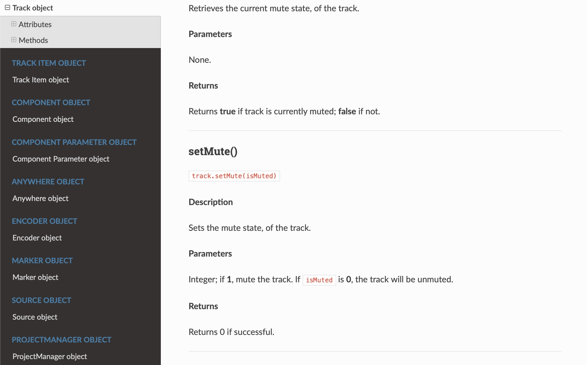

The extracted documentation above shows us that we can execute the <code>setMute()</code> function if we have a `Track Object`. 

Again, if this is not making sense, don't worry we'll unpack all of it throughout the series. However, something to note, is that the documentation for especially the Premiere Pro API is sometimes a bit outdated or faulty. For example, the `setMute()` method shown in the image above takes 1 parameter, `isMuted`. However, the main definition is missing the argument, as shown below, making it a bit confusing.

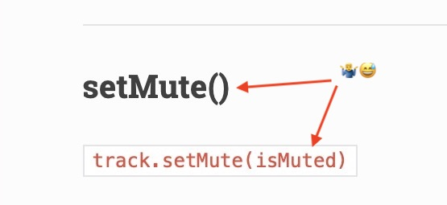

Also, _all_ the available methods aren't always documented in the main API documentation - this is, unfortunately, the other side of the open-source community. Things are usually screened, but as the API changes, documentation isn't always kept up to date and it's up to us, the open source community, to improve discrepancies like this. Luckily, Adobe is always keen to help and they've got a dedicated guy looking out for the Premiere Pro API concerns, Bruce Bullis. You can drop him a mail if you have any question at bbb@adobe.com and he usually comes back within a few days with some advice or points you in a direction. You'll also see him very active on the Adobe API forums. 


## How everything fits together

Let's look at how the various components fit together to get you up and running to develop some ExtendScript using the Premiere API in VS Code.

<table style="width:100%">
    <tr>
        <th style="text-align:left">Component</th>
        <th style="text-align:left">Description</th>
    </tr>
    <tr>
        <td style="text-align:right">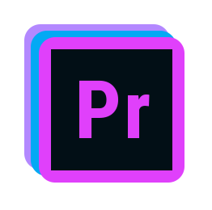</td>
        <td><b>The host - any Adobe application</b> 
        <br><br>
        Get used to calling your Adobe applications like Premiere Pro, Photoshop or After Effects the <i>host</i> application. This is to make a distinction between the client (the code we'll be writing) and the Adobe application we're interacting with - the host.<br><br>
        For now we'll just be executing our ExtendScript from VS Code, so our client will be VS Code. However, if you start building extensions to make your ExtendScript more reusable, then your HTML extension panel will be the client.<br><br></td>
    </tr>
    <tr>
        <td style="text-align:right">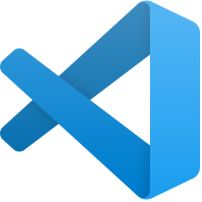</td>
        <td><b>VS Code - the IDE</b>
        <br><br>
        This is the application we'll use to write and debug our ExtendScript code. There are various IDEs out there, like: <a href='https://atom.io/'>Atom</a>, <a href='https://www.sublimetext.com/'>Sublime Text</a> or <a href='https://notepad-plus-plus.org/downloads/'>Notepad++</a>. However, none of them quite compare to VS Code.<sup>[Citation Needed]</sup>
        <br><br>
        Besides the fact that VS Code is the only IDE, besides ExtendScript Toolkit, that has an extension to plug into your Adobe applications to debug your code, the UX of VS Code and all the other extension you can install will quickly make VS Code your default editor for everything. Hell, I'm typing this document in VS Code at this moment...
        <br><br>
        </td>
    </tr>
    <tr>
        <td style="text-align:right"></td>
        <td><b>ExtendScript - the programming language</b> 
        <br><br>
        To be honest, Adobe could have chosen a better name for their programming language. "ExtendScript" is an attempt to convey the idea of - wait for it - "Extend"-ing JavaScript.
        <br>
        <br>
        The reason why I think "ExtendScript" is not the best choice of programming language name for the Adobe suite of tools is due to the file extension,  <code>.jsx </code>. You might be thinking, what's wrong with jsx? JavaScript files are <code>.js</code>, extending them leads to a <code>.jsx</code> extension. And I agree with you're logic... 😉
        <br><br>
        However! If you Google  <code>.jsx </code> you'll find a can of worms not entirely unrelated to making extensions for Adobe hosts, but enough so to confuse you. Beware,  <code>.jsx </code> is a very common file extension and don't expect all  <code>.jsx</code> files to be Adobe ExtendScript files, on the contrary, expect they're not! 
        <br><br>
        To give you a taste of the code you'll be writing, below I show some code written in the <b>Adobe ExtendScript</b>  language that uses the <b>Premiere Pro API</b> to set the mute state the first video clip to true.<br>
        <pre>videoTracks = app.project.activeSequence.videoTracks; // Get all the video tracks
firstTrack = videoTracks[0]; // Get the first video track
firstTrack.setMute(true); // Set the firstTrack's muted attribute using the setMute method</pre>
        The code above follows 3 steps to change the mute attribute of the first track to true. 
        <ul>
        <li>First we get all the video track objects of the active sequence and store them in a list called <code>videoTracks</code>.</li>
        <li>
        We can then select the first video track by using the <code>videoTracks[0]</code> syntax and store the first track object in a variable called <code>firstTrack</code>. Unfortunately, video track <code>1</code> in Premiere Pro is at position <code>0</code> in the <code>videoTracks</code> list. Not a train smash, but we'll have to remember that in future. 
        </li>
        <li>Now that we've got a grip on the first track in Premiere Pro via the <code>firstTrack</code> variable, we can execute the <code>setMute</code> method. 
        </li>
        </ul>
        For the interest sake, we could've done the same thing in one step:
        <pre>
app.project.activeSequence.videoTracks[0].setMute(true)</pre>
However, code readability goes a long way and is usually preferred over cryptic concise code that makes little sense. How descriptive or concise you want to write your code is up to you - you'll develop your own style with time. If you're starting out, write out as much as you can, making temporary variables along the way to make your code more readable and more understandable - comments also help. 
<br><br>
         </td>
    </tr>
    <tr>
        <td style="text-align:right"></td>
        <td><b><a href='https://marketplace.visualstudio.com/items?itemName=Adobe.extendscript-debug'>VS Code ExtendScript Debugger</a> - the extension</b>
        <br><br>In my personal opinion, the VS Code ExtendScript Debugger is what is making programming in ExtendScript within the Adobe applications more accessible to non-programmers in recent years. 
        <br><br>
        In essence, the extension translates our written JavaScript or "ExtendScript" code to commands that the Adobe host applications can understand. In other words, the extension allows us to use VS Code to debug and run our code against an Adobe application. The previous industry standard was Adobe's ExtendScript Toolkit, which as I mentioned, wasn't known for its accessibility.</td>
    </tr>

</table>

In summary, we'll hook-up our VS Code text editor with the Adobe applications through the ExtendScript Debugger extension which will allow us to execute and debug ExtendScript code from within VS Code. How all these components fit together looks something like this: 

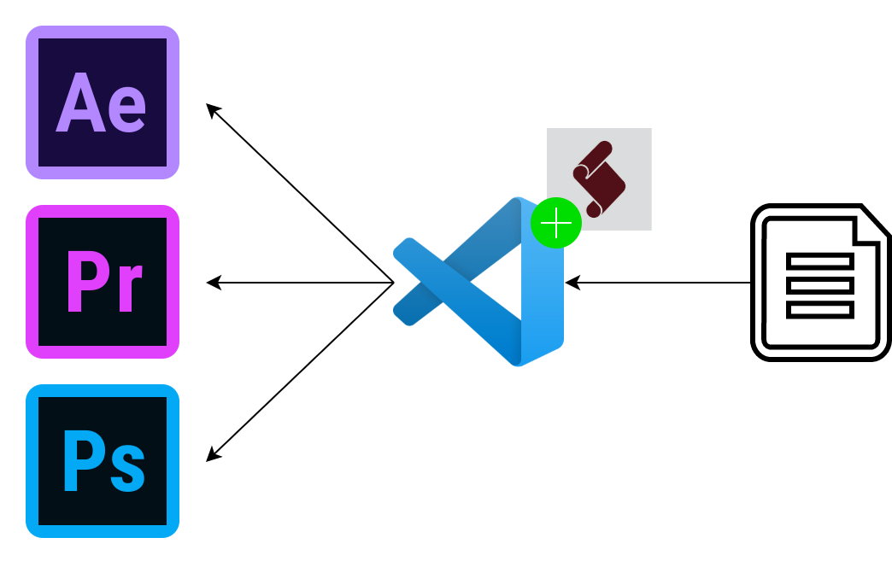

# Setting Everything Up

## VS Code

First, we'll head over to the VS Code website  <a href='https://code.visualstudio.com/'>here</a> and do the download deed for your operating system. 

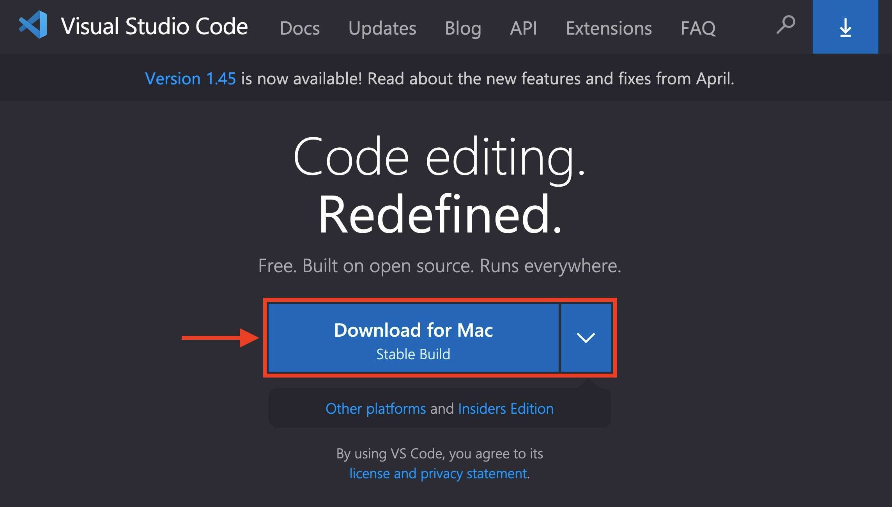

Go ahead and click the next-next-next on Windows or drag VS Code into Applications on Mac.

## Debug Extension

Next, we're going to install the ExtendScript Debugger extension by going to the extensions tab within VS Code. You can find the extension tab by clicking on the 4 square icon, 👇 this one.


Once on the extension tab, you can search for the term "ExtendScript". You should now see something simliar to:

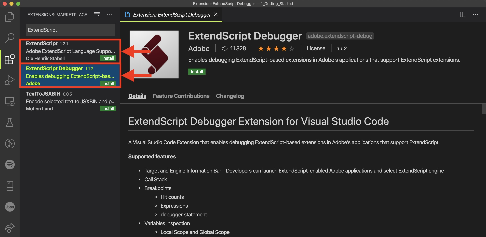

Go ahead and install both the <b>ExtendScript Debugger</b> extension as well as the extension just titled <b>ExtendScript</b>. The later extension will allow for syntax highlighting for the ExtendScript language within VS Code. In other words, VS Code becomes aware of what are valid ExtendScript commands and colours your files accordingly. To be sure the extensions are successfully installed, go ahead and close and reopen VS Code.


# Running some code

## Creating a VS Code folder as to serve as a workspace

To execute some code, we'll need a folder to act as our workspace to hold all our files. Create a new folder somewhere on your drive and open that folder with VS code by going to `File > Open Workspace`. Then create a new file within VS Code by going to  `File > New File` and saving it as `muteTrack1.jsx` in your workspace folder.

Next, you can copy-paste the following ExtendScript code into the `muteTrack1.jsx` file and save.

```javascript
videoTracks = app.project.activeSequence.videoTracks; // Get all the video tracks
firstTrack = videoTracks[0]; // Get the first video track
firstTrack.setMute(true); // Set the firstTrack's muted attribute using the setMute method
```

## The launch.json file

Next, we need to create a `launch.json` file for our debugger to know which file to execute when we hit run. 

Head over to the debug tab within VS code and create a `launch.json` file.

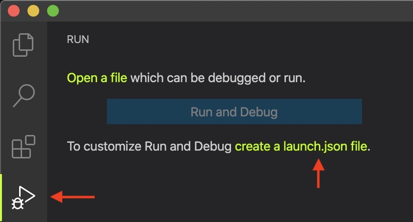

If you've already installed the ExtendScript Debugger Extension you should see the option to add the  ExtendScript Debug configuration by selecting the `ExtendScript Debug` as the environment. 

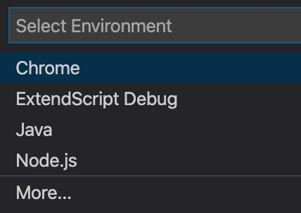

This should create a launch.json file with the following contents:

```javascript
{
    // Use IntelliSense to learn about possible attributes.
    // Hover to view descriptions of existing attributes.
    // For more information, visit: https://go.microsoft.com/fwlink/?linkid=830387
    "version": "0.2.0",
    "configurations": [
        {
            "type": "extendscript-debug",
            "request": "launch",
            "name": "Ask for script name",
            "program": "${workspaceFolder}/${command:AskForScriptName}",
            "stopOnEntry": false
        }
    ]
}
```

You should also see a configuration to run in the debug tab, which reflects the default script configuration we just added. The default ExtendScript Debug configuration asks the user to supply the script path to execute relative to the `workspaceFolder`. 

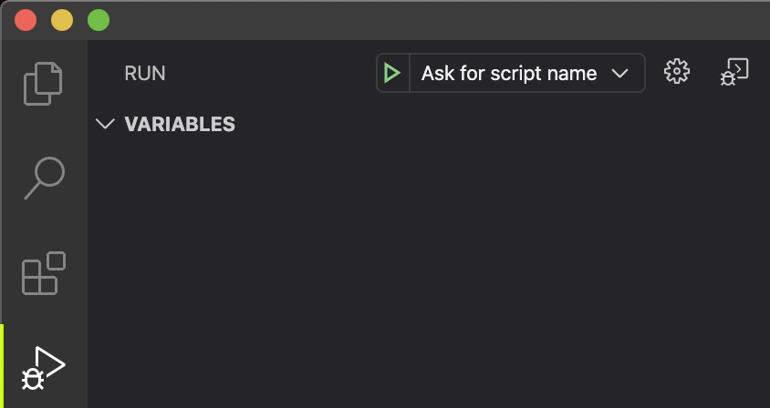


## Executing the code

You can see execute the `Ask for script name` task by pressing the ▷ icon in the debug panel. An input dialog will pop-up, enter `muteTrack1.jsx` and hit enter.

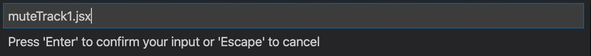

This should bring up the following error...


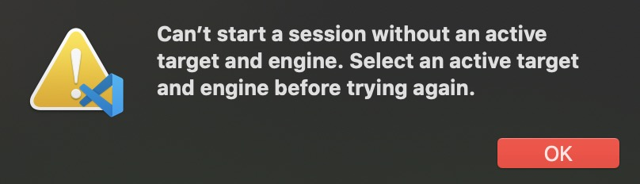

That's right, we still have to tell VS Code to which Adobe host application it should target our code at. If you look at the bottom of VS Code, you should see some yellow text saying: `Select the target application`.


This should bring up the following dialogue which will detect what Adobe application you have installed and allow you to select them as a target. Make sure the target application you want to select is open, and then select the target. For me today the target will be `Adobe Premiere Pr CC 2019`. You should then see the yellow text `Select the target application` change to your selected target. 

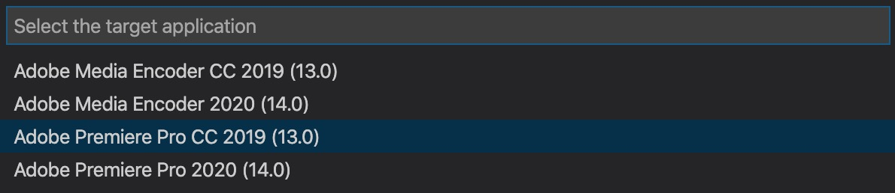

If you hit the ▷ again and insert `muteTrack1.jsx` VS Code should execute the code and your first video track in Premiere Pro should be muted. 

## Speeding up our development life cycle

You might want to change your `launch.json` file to 

```javascript
{
    // Use IntelliSense to learn about possible attributes.
    // Hover to view descriptions of existing attributes.
    // For more information, visit: https://go.microsoft.com/fwlink/?linkid=830387
    "version": "0.2.0",
    "configurations": [
        {
            "type": "extendscript-debug",
            "request": "launch",
            "name": "Mute Track 1",
            "program": "${workspaceFolder}/muteTrack1.jsx",
            "stopOnEntry": false
        }
    ]
}
```
****
This way you won't have to paste the filename into the dialogue every time. 

Change the last line in your `muteTrack1.jsx` file to `firstTrack.setMute(false);` and see what happens when you execute it again.

# Conclusion

Depending on where you are on your coding journey, this tutorial covered a few novel concepts or a lot of novel concepts, here is a summary of what we looked at. 

We covered what an IDE is and how VS Code has replaced Adobe's ExtendSCript Toolkit UI as the default IDE to develop ExtendScript - Adobe's extended JavaScript language used to control their applications via an API. 

We briefly touched on what an API is and how you could possibly control the loudness of your dog's bark using one. 

We then looked at how the host application, VS Code, your code and the VS Code ExtendScript Debugger all fit together. 

After installing VS Code and the debugger we created a workspace folder in VS Code and added a `launch.json` file to enable us to execute some code. 

We finished-up by attaching a host application to VS Code and muting the first video track.